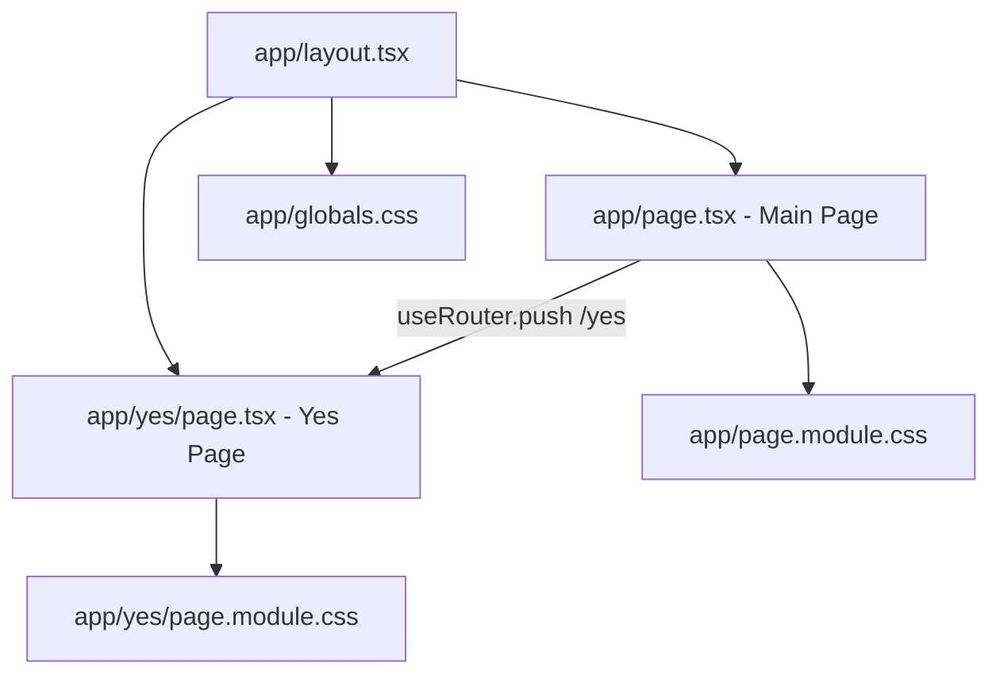

# Design Document: Next.js Valentine Conversion

## Overview

This design converts a static HTML/CSS/JS Valentine's Day interactive page into a Next.js 14+ App Router application using TypeScript and CSS Modules. The architecture leverages React's component model and state management to replace direct DOM manipulation while preserving identical visual styling and interactive behavior. The application consists of two routes: a main question page and a success celebration page.

## Architecture

The application follows the Next.js App Router convention with file-system-based routing. Since the main page requires client-side interactivity (state for button text cycling and font-size growth), it uses the `"use client"` directive. The yes page is purely presentational and can remain a server component.



### Routing

| Route  | File               | Component Type   | Description                                 |
| ------ | ------------------ | ---------------- | ------------------------------------------- |
| `/`    | `app/page.tsx`     | Client Component | Valentine question with interactive buttons |
| `/yes` | `app/yes/page.tsx` | Server Component | Celebration page with hugging GIF           |

### Key Design Decisions

1. **Client Component for Main Page**: The main page requires `useState` for tracking message index and button font size, necessitating the `"use client"` directive. Only this page needs client-side interactivity.

2. **Server Component for Yes Page**: The yes page is static content with no interactivity, so it remains a server component for optimal performance.

3. **CSS Modules over Tailwind**: CSS Modules are chosen to most faithfully replicate the existing CSS with minimal transformation. Each page gets its own `.module.css` file, mirroring the original `styles.css` and `yes_style.css` split.

4. **next/image with unoptimized**: Animated GIFs lose their animation when processed by Next.js image optimization. Using `unoptimized` on the `<Image>` component preserves GIF animation while still benefiting from the component's layout features.

5. **Inline fontSize via style prop**: The Yes button's font-size grows dynamically via React state. This is applied as an inline `style` prop since CSS Modules cannot handle dynamic values. A CSS `transition` property on the button class provides smooth animation.

6. **Message list as a module-level constant**: The array of No button messages is defined as a `const` outside the component to avoid re-creation on each render.

## Components and Interfaces

### app/layout.tsx — Root Layout

```typescript
// Standard Next.js root layout
// Sets metadata (title: "Valentine")
// Applies globals.css (resets margin, sets Arial font)
// Wraps children in html > body
```

### app/page.tsx — Main Page (Client Component)

```typescript
"use client";

// State:
//   messageIndex: number (initially 0)
//   yesFontSize: number (initially 1.5, in em units)

// Constants (module-level):
//   MESSAGES: string[] — the 10 No button messages

// handleNoClick():
//   1. Set No button text to MESSAGES[messageIndex]
//   2. Increment messageIndex using modulo: (messageIndex + 1) % MESSAGES.length
//   3. Multiply yesFontSize by 1.5

// handleYesClick():
//   1. Call router.push("/yes") using useRouter from next/navigation

// Render:
//   - Container div (centered layout)
//   - h1: "Will you be my Valentine?????"
//   - Buttons div containing Yes and No buttons
//   - Yes button: onClick={handleYesClick}, style={{ fontSize: `${yesFontSize}em` }}
//   - No button: onClick={handleNoClick}, text from state (default "No")
//   - Image: animated cat GIF via next/image with unoptimized
```

### app/yes/page.tsx — Yes Page (Server Component)

```typescript
// Pure presentational component, no client-side state needed

// Render:
//   - Container div (centered layout)
//   - h1: "Knew you would say yes!"
//   - Image: hugging characters GIF via next/image with unoptimized
```

### app/globals.css

```css
/* Minimal global reset */
* {
    box-sizing: border-box;
}
body {
    margin: 0;
    font-family: "Arial", sans-serif;
}
```

### app/page.module.css

```css
/* Mirrors styles.css exactly */
.body {
    /* applied to outermost wrapper or body via layout */
    display: flex;
    justify-content: center;
    align-items: center;
    height: 100vh;
    background-color: #f9e3e3;
    flex-direction: column;
}
.container {
    text-align: center;
}
.title {
    font-size: 2.5em;
    color: #d32f2f;
}
.buttons {
    margin-top: 20px;
}
.yesButton {
    font-size: 1.5em;
    padding: 10px 20px;
    margin-right: 10px;
    background-color: #4caf50;
    color: white;
    border: none;
    border-radius: 5px;
    cursor: pointer;
    transition: font-size 0.3s ease; /* smooth growth */
}
.noButton {
    font-size: 1.5em;
    padding: 10px 20px;
    background-color: #f44336;
    color: white;
    border: none;
    border-radius: 5px;
    cursor: pointer;
}
.gifContainer img {
    /* or applied to Image component */
    max-width: 100%;
    height: auto;
    border-radius: 10px;
    margin-top: 20px;
}
```

### app/yes/page.module.css

```css
/* Mirrors yes_style.css exactly */
.body {
    display: flex;
    justify-content: center;
    align-items: center;
    height: 100vh;
    background-color: #f9e3e3;
}
.container {
    text-align: center;
}
.headerText {
    font-size: 3em;
    color: #d32f2f;
}
.gifContainer img {
    width: 100%;
    max-width: 500px;
    height: auto;
}
```

## Data Models

### Component State (Main Page)

| State Variable | Type     | Initial Value | Description                                                                           |
| -------------- | -------- | ------------- | ------------------------------------------------------------------------------------- |
| `messageIndex` | `number` | `0`           | Current index into the MESSAGES array, incremented modulo 10 on each No click         |
| `yesFontSize`  | `number` | `1.5`         | Current font size of the Yes button in `em` units, multiplied by 1.5 on each No click |

### Constants

| Constant   | Type                | Description                                                |
| ---------- | ------------------- | ---------------------------------------------------------- |
| `MESSAGES` | `readonly string[]` | Array of 10 persuasive messages displayed on the No button |

### No Button Display Text Logic

The No button displays:

- `"No"` when `messageIndex === 0` and no clicks have occurred (initial state)
- `MESSAGES[previousIndex]` after each click, where the index was set before incrementing

More precisely, a separate state variable `noButtonText` (initial value `"No"`) is updated to `MESSAGES[messageIndex]` before `messageIndex` is incremented. Alternatively, the component can derive the display text: if no clicks have happened, show `"No"`; otherwise show `MESSAGES[(messageIndex - 1 + MESSAGES.length) % MESSAGES.length]`. The simpler approach is to use a third state variable or track click count.

Recommended approach: track `noClickCount` (number, initially 0). Display text is `noClickCount === 0 ? "No" : MESSAGES[(noClickCount - 1) % MESSAGES.length]`. Font size is `1.5 * Math.pow(1.5, noClickCount)` em — but this diverges from the original which compounds from the current computed size. To match exactly: store `yesFontSize` in state and multiply by 1.5 each click.

**Simplified state model:**

| State Variable | Type     | Initial Value | Update on No Click  |
| -------------- | -------- | ------------- | ------------------- |
| `noClickCount` | `number` | `0`           | `noClickCount + 1`  |
| `yesFontSize`  | `number` | `1.5`         | `yesFontSize * 1.5` |

Display text derivation: `noClickCount === 0 ? "No" : MESSAGES[(noClickCount - 1) % MESSAGES.length]`

### Next.js Configuration

```typescript
// next.config.ts
const nextConfig = {
    images: {
        remotePatterns: [
            {
                protocol: "https",
                hostname: "media1.giphy.com",
            },
            {
                protocol: "https",
                hostname: "media4.giphy.com",
            },
        ],
        unoptimized: true, // preserve GIF animation globally
    },
};
```

## Correctness Properties

_A property is a characteristic or behavior that should hold true across all valid executions of a system — essentially, a formal statement about what the system should do. Properties serve as the bridge between human-readable specifications and machine-verifiable correctness guarantees._

The prework analysis identified two testable properties from the acceptance criteria. Most requirements are visual/styling checks best covered by example-based unit tests. The interactive behavior of the No button, however, involves state transitions that apply universally across all click counts, making them ideal for property-based testing.

### Property 1: No button text cycling

_For any_ non-negative integer N representing the number of No button clicks, the displayed No button text after N clicks should equal `MESSAGES[(N - 1) % MESSAGES.length]` for N > 0, and `"No"` for N = 0. This holds regardless of how large N grows — the modulo operation ensures correct cycling.

**Validates: Requirements 2.1, 2.3**

### Property 2: Yes button font size exponential growth

_For any_ non-negative integer N representing the number of No button clicks, the Yes button font size after N clicks should equal `1.5 * (1.5 ^ N)` em. Each click multiplies the previous size by exactly 1.5, producing exponential growth from the initial 1.5em base.

**Validates: Requirements 2.2**

## Error Handling

This application has minimal error surface given its simplicity:

| Scenario             | Handling                                                                                                                     |
| -------------------- | ---------------------------------------------------------------------------------------------------------------------------- |
| GIF fails to load    | The `next/image` component renders the `alt` text as fallback. No additional error handling needed.                          |
| Invalid route access | Next.js App Router returns a default 404 page for unmatched routes. A custom `not-found.tsx` is optional.                    |
| JavaScript disabled  | The page renders with static content (title, GIF visible). Buttons won't function, which is acceptable for this novelty app. |

No server-side data fetching, API calls, or user input validation (beyond the button clicks) exist in this application, so error handling is inherently minimal.

## Testing Strategy

### Property-Based Tests

Use `fast-check` as the property-based testing library with `vitest` as the test runner.

Each property test should run a minimum of 100 iterations with randomly generated click counts.

- **Property 1 test**: Generate random non-negative integers (0–1000). For each N, simulate N No-button clicks and verify the displayed text matches `N === 0 ? "No" : MESSAGES[(N - 1) % 10]`.
    - Tag: **Feature: nextjs-valentine-conversion, Property 1: No button text cycling**

- **Property 2 test**: Generate random non-negative integers (0–50, capped to avoid floating-point overflow). For each N, simulate N No-button clicks and verify the Yes button font size equals `1.5 * Math.pow(1.5, N)` within floating-point tolerance.
    - Tag: **Feature: nextjs-valentine-conversion, Property 2: Yes button font size exponential growth**

### Unit Tests

Unit tests complement property tests by covering specific examples, edge cases, and visual/structural checks:

- **Main page rendering**: Verify title text, button labels, GIF src URL, and CSS classes are present (Requirements 1.1–1.6)
- **No button first click**: Verify text changes to "Are you sure?" and font size becomes 2.25em (Requirements 2.1, 2.2)
- **No button 10th click**: Verify cycling wraps to first message (Requirement 2.3)
- **Message list content**: Verify MESSAGES array contains exactly the 10 specified strings (Requirement 2.4)
- **Yes button click**: Verify `router.push("/yes")` is called (Requirement 3.1)
- **Yes page rendering**: Verify title text, GIF src URL, and styling classes (Requirements 4.1–4.3)
- **Image components**: Verify `unoptimized` prop is set on all Image components (Requirement 6.3)

### Testing Tools

| Tool                          | Purpose                             |
| ----------------------------- | ----------------------------------- |
| `vitest`                      | Test runner                         |
| `@testing-library/react`      | Component rendering and interaction |
| `fast-check`                  | Property-based test generation      |
| `@testing-library/user-event` | Simulating button clicks            |
